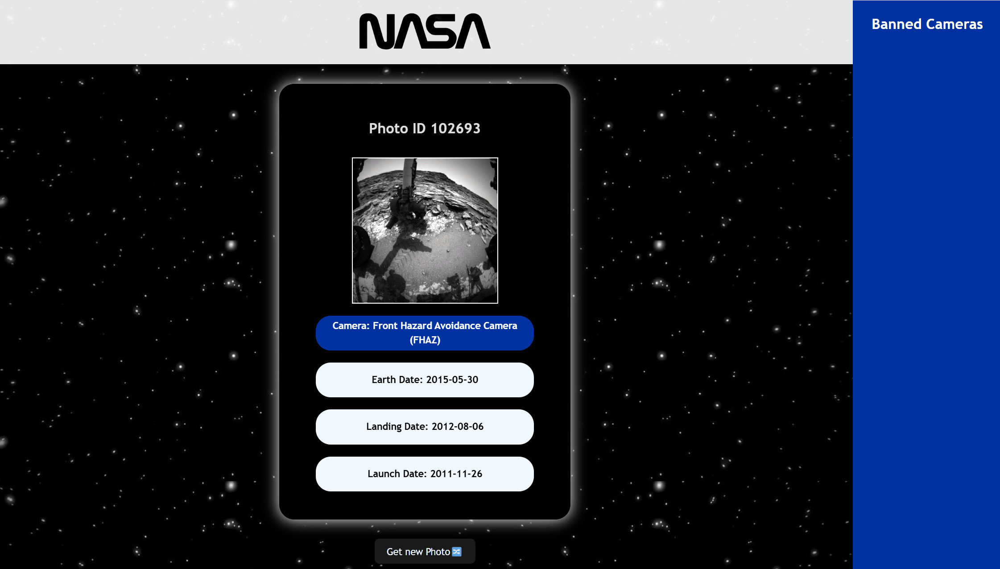

# Explore Mars! – NASA Rover Photo Explorer

**Author:** Soluchi Fidel-Ibeabuchi
**Role:** Developer | Computer Science Student @ Howard University

**Explore Mars!** is an interactive web app that pulls **real images from NASA’s Curiosity Rover API**. Users can generate random rover photos, explore metadata (launch date, landing date, Earth date, and camera type), and filter out results dynamically using a custom **ban list feature**.

This project demonstrates my ability to **work with external APIs, handle JSON data dynamically, and implement interactive state-driven UI logic.**

---

## 🚀 Features

### Core Functionality

* **Random Image Fetching:** Each button click fetches a new Curiosity Rover photo with associated attributes.
* **Dynamic Metadata Display:** Users see consistent metadata (launch date, landing date, Earth date, and camera type) tied to each image.
* **Ban List Filtering:** Users can click on an attribute to **ban it** (e.g., a specific camera type). Future API results exclude that attribute.
* **Real-Time Ban Management:** Clicking a banned attribute removes it instantly from the ban list, restoring it to future results.
* **Single-Result Display:** Only one image/metadata pair is shown at a time for a clean user experience.

### Extended Functionality (Future Enhancements)

* Multiple attributes could be made filterable (e.g., banning both camera types and Earth dates).
* Session-based history tracking for previously viewed rover images.

---

## 🛠️ Tech Stack

* **Frontend:** React
* **Data Source:** NASA Mars Rover Photos API
* **Visualization & State:** Dynamic JSON parsing, interactive filtering logic
* **Version Control:** Git/GitHub

---

## 📸 Demo & Walkthrough

  

---

## ⚡ Challenges & Learnings

* **API Integration:** Learned to work with NASA’s Curiosity Rover API, parsing JSON responses into consistent UI components.
* **Dynamic Filtering:** Built a ban list system to filter out unwanted attributes in real time, requiring careful state management.
* **UI/UX Logic:** Designed the app to balance randomness with user control, ensuring new content feels fresh but never breaks user-set rules.

---

## 📚 Key Takeaways

* Strengthened skills in **API consumption, JSON handling, and conditional rendering.**
* Implemented an **interactive filtering system** that demonstrates practical use of dynamic state in web apps.
* Applied real-world data to build a project that’s both technically sound and engaging.

---

## 📄 License

Apache 2.0 License © 2025 Soluchi Fidel-Ibeabuchi

---
